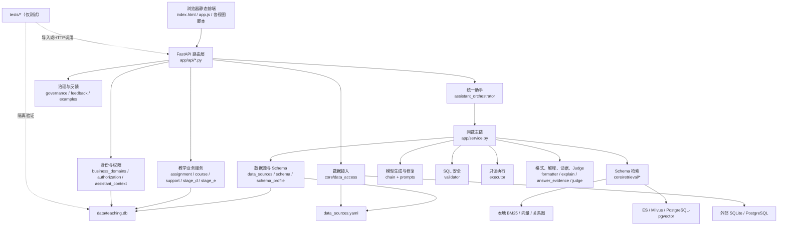

# zjh-dev 项目文件分类、职责与修改关系目录

更新日期：2026-07-29

审查对象：`zjh-dev` 当前工作区（HEAD：`e6d4485a5f8611ce1374cfb3ac68f470623f5235`）

审查方式：Git 文件清单、Python AST、前端静态文件、配置、测试名称、项目问题与修改记录的只读交叉核对

## 1. 文档目的与范围

本文集中说明当前项目文件的分类、职责、调用关系、测试覆盖以及相对 HEAD 的修改情况，避免在每个源码文件中追加说明性注释而扩大代码变化。

纳入范围：

- Git 已跟踪的 173 个文件；
- 当前明确属于项目成果的 4 个未跟踪文件：`PROJECT_ISSUES.md`、`PROJECT_CHANGES.md`、`PROJECT_PROGRESS.md`、`tests/test_external_data_access.py`；
- 本文自身和本次新增的 `docs/project_test_guide.md`。

不纳入逐文件目录：

- `.git/`、`.venv/`、`__pycache__/`、pytest 缓存；
- 被忽略的 `.env`、私有演示账号、上传文件、日志、PID、检索索引和 Docker volume；
- 仓库外 BIRD、外部 SQLite/PostgreSQL、浏览器截图和真实验收证据。

状态标记：

| 标记 | 含义 |
|---|---|
| 未改 | 与 HEAD `e6d4485` 内容一致 |
| 已改 | 当前工作区相对 HEAD 有未提交修改 |
| 新增 | 当前为未跟踪的新文件，尚未提交 |
| 运行数据已改 | 二进制或运行态数据发生变化，不能按普通源码差异解释 |

重要边界：

- `tests/`、评测 YAML 和评测脚本不参与 Web 服务运行；它们通过导入、HTTP 测试客户端或隔离数据库验证产品实现。
- `docs/` 不参与运行；文档中的“计划”“完成报告”不能单独证明功能已经实现，当前实现状态以源码、`docs/project_feature_catalog.md` 和实际测试证据为准。
- `scripts/seed_*.py` 会主动生成或重建数据，不能当作普通只读测试运行。
- 本文记录“文件级可追溯关系”，不声称能够从当前未提交的累计 diff 还原每一行的独立修改时间。

## 2. 总体结构和调用关系

### 2.1 应用启动链

1. `app/main.py` 创建 FastAPI 应用。
2. lifespan 启动时调用 `app/core/teaching_migrations.py::ensure_mvp_schema()`。
3. `ensure_mvp_schema()`补齐教学业务表、演示数据和身份岗位基础，再调用 V3 迁移账本。
4. `app/main.py`挂载五组路由和`app/static/`前端。
5. 开启预热时，后台调用`app/core/retrieval/pipeline.py::warm_all()`。

### 2.2 统一助手与 NL2SQL 链

1. `app/static/assistant-panel.js`通过`app/static/api.js`调用`POST /api/assistant/query`。
2. `app/api/assistant.py`认证后调用`assistant_orchestrator.query_assistant()`。
3. 编排器验证页面/角色/数据源上下文，读取服务端会话历史，优先匹配确定性业务路由。
4. 需要问数时调用`app/service.py::ask()`。
5. `service.ask()`依次执行数据源选择、角色过滤后的 Schema、检索、Qwen SQL 生成、安全校验、只读执行、失败回修、结果格式化和可选 Judge。
6. `answer_evidence.py`补充范围、证据、质量标记并持久化脱敏执行轨迹。
7. `action_drafts.py`根据结果生成待确认动作草稿，不直接执行高风险操作。

### 2.3 教学业务链

- `app/api/teaching.py`只负责请求模型和异常到 HTTP 的转换。
- `authorization.py`负责资源级权限。
- `assignment_workflow.py`、`course_analytics.py`、`stage_d.py`、`stage_e.py`、`support_workflow.py`负责具体教学流程。
- 业务写操作最终进入`data/teaching.db`，同时可能写通知、审计或状态历史。

### 2.4 外部数据接入链

1. 管理员在`index.html`的数据接入页操作，`data-access-view.js`调用`api.js`。
2. `app/api/data_access.py`执行管理员/维护者权限检查。
3. `app/core/data_access.py`负责注册、扫描、导入和受控表维护。
4. `app/core/data_sources.py`从`data_sources.yaml`加载注册项，并从环境变量解析 PostgreSQL 密码。
5. 统一助手的外部源选择经`assistant_context.py`重新鉴权，并由`assistant_orchestrator.py`锁定到会话。

## 3. 根目录、入口和部署文件

| 文件 | 类型 | 作用与关系 | 状态/修改说明 |
|---|---|---|---|
| `.env.example` | 配置模板 | 展示模型、认证、执行限制和检索环境变量；真实值应复制到被忽略的`.env` | 未改；模板占位值不是运行密钥 |
| `.gitignore` | Git规则 | 排除环境、缓存、日志、上传、运行库和私有账号；显式保留`data/teaching.db` | 未改 |
| `AGENTS.md` | 仓库维护规则 | 要求功能变化同步`docs/project_feature_catalog.md`，区分已实现/条件可用/未实现 | 未改 |
| `LICENSE` | 许可证 | 项目授权文本，不参与运行 | 未改 |
| `README.md` | 使用说明 | 项目定位、安装、启动、数据源、检索和治理说明；入口指向功能目录 | 未改；部分历史示例可能落后于当前页面，当前能力以功能目录为准 |
| `requirements.txt` | Python依赖 | FastAPI、LangChain、Qwen、SQLAlchemy、检索、测试等依赖清单 | 未改 |
| `data_sources.yaml` | 运行配置 | 默认注册`teaching` SQLite；由`data_sources.py`读取，由数据接入模块受控更新 | 未改；当前仅1个教学源且无内联密码 |
| `docker-compose.yml` | server检索部署 | 启动 Elasticsearch、etcd、MinIO、Milvus、PostgreSQL/pgvector；不启动业务 PostgreSQL | 未改 |
| `docker/es/Dockerfile` | Docker镜像 | 在ES 8.13镜像安装IK中文分词插件 | 未改 |

## 4. 后端入口和 API 文件

| 文件 | 模块 | 作用与主要关系 | 状态/修正 |
|---|---|---|---|
| `app/__init__.py` | Python包 | 标识`app`包 | 未改 |
| `app/main.py` | 应用入口 | 创建FastAPI、执行数据库迁移、挂载API与静态前端、可选检索预热 | 未改 |
| `app/service.py` | NL2SQL主服务 | 串联数据源、Schema、检索、模型、校验、执行、格式化、解释和Judge | 已改；ZJH-001未完成作业语义保护、ZJH-007日期边界、ZJH-011敏感字段/占位回答处理 |
| `app/api/__init__.py` | API包 | 标识API包 | 未改 |
| `app/api/routes.py` | 综合API | 认证、组织、生命周期、工作台、课程空间、Schema、画像、旧问数、Judge、反馈和示例接口 | 已改；ZJH-013外部Schema按外部真实表展示 |
| `app/api/assistant.py` | 统一助手API | 助手查询、质量聚合、动作草稿和会话CRUD；调用编排器及会话服务 | 未改 |
| `app/api/teaching.py` | 教学业务API | 作业、分析、考勤、答疑、教学异常、成绩和支持流程接口 | 未改 |
| `app/api/data_access.py` | 数据接入API | SQLite/CSV/DB/PostgreSQL注册、扫描、表维护和审计接口 | 已改；ZJH-014增加PostgreSQL只读注册和错误脱敏 |
| `app/api/governance.py` | 治理API | 复核队列、接受/拒绝、低可信任务和治理设置 | 未改 |

## 5. 核心 NL2SQL、助手和通用基础模块

| 文件 | 子模块 | 作用与调用关系 | 状态/修正 |
|---|---|---|---|
| `app/core/__init__.py` | 包入口 | 标识核心模块包 | 未改 |
| `app/core/config.py` | 配置 | Pydantic Settings和项目路径；被几乎所有基础模块引用 | 未改 |
| `app/core/data_sources.py` | 数据源 | 读取注册表、识别方言、创建连接、解析外置PostgreSQL密码 | 已改；ZJH-014支持`password_env`且不持久化密码 |
| `app/core/source_router.py` | 数据源路由 | 用模型和数据源目录自动选择数据源；`service.ask()`调用 | 未改 |
| `app/core/schema.py` | Schema加载 | 跨方言读取表列、DDL、枚举、词表和画像屏蔽；供提示词和检索使用 | 未改 |
| `app/core/schema_profile.py` | Schema画像 | 解析表/字段/关系/指标画像，质量检查、版本发布和回滚 | 未改 |
| `app/core/chain.py` | 模型链 | 构造Qwen调用、拼历史消息、生成SQL和失败回修 | 未改 |
| `app/core/validator.py` | SQL安全 | 只允许只读单条SELECT、白名单表列、行级范围、危险函数限制和LIMIT | 已改；ZJH-006多表范围传播、ZJH-003合法括号OR与顶层OR防绕过 |
| `app/core/executor.py` | SQL执行 | SQLAlchemy只读执行、超时和最大行数限制 | 未改 |
| `app/core/formatter.py` | 响应格式 | 组装成功、错误、澄清响应及数据源信息 | 未改 |
| `app/core/explain.py` | 查询解释 | 根据SQL与画像生成面向业务的执行说明和来源提示 | 未改 |
| `app/core/sql_meta.py` | SQL元数据 | 提取输出列表达式来源供前端表头显示 | 未改 |
| `app/core/judge.py` | 质量评分 | 异步暂存与执行LLM Judge，失败时降级；ZJH-008仍是已知边界 | 未改 |
| `app/core/assistant_context.py` | 助手上下文 | 校验页面、课程、学生、学院、时间和外部数据源上下文 | 已改；ZJH-019管理员外部源鉴权与传递 |
| `app/core/assistant_sessions.py` | 助手会话 | 按用户与当前岗位隔离会话、轮次、分页、软删除和最近历史 | 已改；ZJH-002提供最近有效轮次；ZJH-010只改了对应测试 |
| `app/core/assistant_orchestrator.py` | 助手编排 | 确定性指标/业务/导航/NL2SQL路由，会话历史、超时、响应转换和动作建议 | 已改；ZJH-002追问、ZJH-005业务误路由、ZJH-011不支持状态、ZJH-019外部源锁定 |
| `app/core/answer_evidence.py` | 回答证据 | 增补范围、时间、质量标记，生成管理员/普通用户不同粒度轨迹并持久化 | 未改 |
| `app/core/assistant_quality.py` | 质量运营 | 为管理员汇总脱敏的路由、失败、延迟、反馈和治理指标 | 未改 |
| `app/core/action_drafts.py` | 动作草稿 | 白名单动作、创建时与确认时双重鉴权、过期/篡改/角色切换保护 | 未改 |
| `app/core/semantic_metrics.py` | 认证指标 | 读取`data/semantic_metrics.yaml`，让卡片和助手共享确定性业务指标 | 未改 |
| `app/core/business_domains.py` | 身份与业务域 | 登录、令牌、岗位切换、角色能力、表列权限、敏感词和Schema过滤 | 已改；ZJH-011增加敏感身份问题识别 |
| `app/core/authorization.py` | 资源权限 | 教师课程、学生本人、提交、辅导员个案等服务层鉴权 | 未改 |
| `app/models/__init__.py` | 模型包 | 标识Pydantic模型包 | 未改 |
| `app/models/schemas.py` | API模型 | Turn、问数、Schema、反馈、画像、Judge等请求响应模型 | 未改 |

## 6. Schema 检索模块

| 文件 | 检索职责 | 关系 | 状态/修正 |
|---|---|---|---|
| `app/core/retrieval/__init__.py` | 检索包出口 | 导出公共类型和编排入口 | 未改 |
| `app/core/retrieval/base.py` | 公共结构 | `SchemaAtom`、`Hit`、`RetrievedContext`、Retriever接口 | 未改 |
| `app/core/retrieval/atoms.py` | Schema原子 | 将表、列、描述和采样枚举拆成可检索原子 | 未改 |
| `app/core/retrieval/embedding.py` | Embedding | 调用DashScope embedding并归一化向量 | 未改 |
| `app/core/retrieval/keyword.py` | 本地关键词 | rank-bm25关键词召回 | 未改 |
| `app/core/retrieval/vector.py` | 本地向量 | numpy余弦向量召回 | 未改 |
| `app/core/retrieval/es_keyword.py` | server关键词 | Elasticsearch BM25，接口与本地keyword一致 | 未改 |
| `app/core/retrieval/milvus_vector.py` | server向量 | Milvus建索引与向量检索 | 未改 |
| `app/core/retrieval/glossary_vector.py` | server词表 | 解析业务词表并用PostgreSQL/pgvector检索 | 未改 |
| `app/core/retrieval/graph.py` | 关系图 | inspector外键和画像关系建图、PageRank、授权桥接、JOIN路径 | 已改；ZJH-016规范表列大小写、过滤无效关系、去重 |
| `app/core/retrieval/metrics.py` | 指标匹配 | 从画像提取派生指标并按问题匹配 | 未改 |
| `app/core/retrieval/query_expand.py` | 查询扩展 | 用快速模型把中文问题扩展为Schema检索关键词 | 未改 |
| `app/core/retrieval/pipeline.py` | 检索编排 | 小Schema直通；大Schema多路召回、RRF融合、图补全、授权过滤和上下文渲染 | 未改 |

## 7. 教学业务、身份与生命周期模块

| 文件 | 业务模块 | 作用与关系 | 状态 |
|---|---|---|---|
| `app/core/teaching_migrations.py` | 教学迁移/种子 | 启动时补齐MVP表、身份岗位、演示课程作业和业务数据；调用V3迁移 | 未改 |
| `app/core/v3_migrations.py` | V3迁移账本 | 有序、事务化、校验值迁移，维护`v3_schema_migration`和`user_version` | 未改 |
| `app/core/workbench.py` | 角色首页 | 为学生、教师、辅导员、学院、教务、管理员生成确定性工作台数据 | 未改 |
| `app/core/teaching_dashboard.py` | 旧教学驾驶舱 | 生成筛选后的教学统计；当前主要入口已由角色工作台替代 | 未改 |
| `app/core/assignment_workflow.py` | 作业流程 | 作业创建/发布、学生提交/重交、教师退回/评分/发布、附件和通知 | 未改 |
| `app/core/course_space.py` | 课程空间 | 课程公告、回执、资源文件和通知中心 | 未改 |
| `app/core/course_analytics.py` | 课程分析 | 课程范围统计、模板查询、受限NL2SQL、历史和反馈 | 未改 |
| `app/core/stage_d.py` | 考勤与答疑 | 课程场次、批量考勤修正、学生考勤、匿名/公开问答和通知 | 未改 |
| `app/core/stage_e.py` | 教学运行 | 教学任务、异常、成绩提交审核和学院/教务汇总 | 未改 |
| `app/core/support_workflow.py` | 学习支持 | 规则生成个案、辅导员跟进、学生请求和状态流转 | 未改 |
| `app/core/identity_registration.py` | 身份注册 | 学生/教师自助注册、组织范围审批和批量审核 | 未改 |
| `app/core/organization_access.py` | 组织岗位 | 组织目录、岗位任命/结束/调动、影响预览和审核队列 | 未改 |
| `app/core/lifecycle.py` | 人员生命周期 | 账号冻结恢复、学生休复退毕、职工调动离退、二次确认和审计 | 未改 |

## 8. 本地持久化、治理和数据维护辅助模块

| 文件 | 作用 | 关系 | 状态 |
|---|---|---|---|
| `app/core/file_store.py` | 文件锁和原子文本写入 | 被画像、示例、反馈和治理模块复用 | 未改 |
| `app/core/examples.py` | Few-shot示例CRUD | 读写`data/examples/<source>.json`，供问数和治理使用 | 未改 |
| `app/core/feedback.py` | 查询反馈 | 保存、查询、修改、删除反馈记录 | 未改 |
| `app/core/governance.py` | 治理流程 | 复核反馈、低可信结果、画像关系/指标/字段并调用画像或示例模块 | 未改 |
| `app/core/data_access.py` | 数据接入服务 | 注册SQLite/PostgreSQL、导入CSV/DB、扫描、表维护、审计、密码脱敏 | 已改；ZJH-014 |

## 9. 前端文件

前端全部为原生HTML/CSS/JavaScript，通过`api.js`访问后端。前端只控制展示和提交上下文，权限最终由服务端决定。

| 文件 | 作用与联系 | 状态/修正 |
|---|---|---|
| `app/static/index.html` | 单页应用骨架、登录、角色页、数据接入表单、统一助手挂载点和脚本顺序 | 已改；ZJH-011状态样式缓存标识、ZJH-014 PostgreSQL表单、ZJH-018/019资源版本 |
| `app/static/style.css` | 全站布局、工作台、表格、表单、响应式样式 | 未改 |
| `app/static/app.js` | 主应用状态、登录/切换角色、导航、工作台、各业务页渲染和助手入口上下文 | 已改；ZJH-019外部数据源进入助手时携带source |
| `app/static/api.js` | 统一fetch客户端和各API包装函数 | 已改；ZJH-014增加PostgreSQL注册调用 |
| `app/static/assistant-panel.js` | V3助手提问、状态展示、结果表、证据、动作草稿、确认和错误处理 | 已改；ZJH-011增加unsupported状态 |
| `app/static/assistant-panel.css` | 助手面板状态、结果、动作和响应式样式 | 已改；ZJH-011 unsupported样式 |
| `app/static/data-access-view.js` | 数据源列表、SQLite/CSV/DB/PostgreSQL注册、扫描、表浏览和维护 | 已改；ZJH-014 PostgreSQL表单；ZJH-018保存稳定form引用避免成功后误报 |
| `app/static/governance-view.js` | 画像编辑、质量报告、版本和治理复核页面 | 未改 |
| `app/static/modal.js` | 通用确认对话框 | 未改 |

## 10. 数据、画像、词表和提示词

| 文件 | 类型 | 作用与消费者 | 状态/修正 |
|---|---|---|---|
| `data/teaching.db` | SQLite二进制 | 默认教学事实库、身份岗位、业务流程、助手会话等；启动迁移会修改 | 运行数据已改；基线17表/version 0，当前68表/version 3005并含运行会话，是否提交单独待定 |
| `data/schema_profiles/teaching.yaml` | Schema画像 | 表粒度、字段语义、枚举、关系和指标；供Schema、检索、提示词和治理使用 | 已改；ZJH-001补充未完成作业连接/状态口径 |
| `data/glossaries/teaching.md` | 业务词表 | 教学术语、Join规则、派生指标；本地条件注入和server词表检索使用 | 未改；其中部分旧作业口径需以当前画像和服务保护为准 |
| `data/examples/teaching.json` | Few-shot示例 | 已确认教学问题及标准SQL；由`examples.py`和治理使用 | 未改 |
| `data/semantic_metrics.yaml` | 指标目录 | 角色、页面、公式、样本阈值和范围；由`semantic_metrics.py`读取 | 未改 |
| `prompts/sql_prompt.txt` | SQL生成提示词 | `chain.generate_sql()`使用 | 已改；ZJH-001未完成作业硬规则、ZJH-007日期边界规则 |
| `prompts/sql_repair_prompt.txt` | SQL修复提示词 | `chain.repair_sql()`根据错误和原问题回修 | 未改 |
| `prompts/router_prompt.txt` | 数据源路由提示词 | `source_router.py`使用 | 未改 |
| `prompts/query_expand_prompt.txt` | 查询扩展提示词 | `retrieval/query_expand.py`使用 | 未改 |
| `prompts/judge_prompt.txt` | Judge提示词 | `judge.py`使用 | 未改；ZJH-008说明Judge仍不是正确性证明 |

## 11. 运维、数据生成和评测脚本

| 文件 | 类型 | 作用与风险边界 | 状态 |
|---|---|---|---|
| `scripts/eval.py` | 离线评测 | 读取评测集，生成SQL并按cell/rowset/ordered比较执行结果 | 未改；会调用模型和数据库，不是单元测试 |
| `scripts/eval_v3_scenarios.py` | V3场景评测 | 校验角色场景契约，确定性/可选模型执行，输出脱敏汇总 | 未改 |
| `scripts/run_stage_f_regression.py` | 产品回归 | 执行六角色矩阵和确定性演示流程 | 未改 |
| `scripts/verify_server_backend.py` | server验收 | 检查Milvus、ES、pgvector和关系图是否真实使用 | 未改；依赖Docker和模型网络 |
| `scripts/start_lan_server.ps1` | 启动脚本 | 在Windows局域网启动Uvicorn并记录日志 | 未改 |
| `scripts/seed_db.py` | 数据生成 | 生成旧电商示例库`data/app.db` | 未改；会覆盖/生成数据库，不是普通测试 |
| `scripts/seed_teaching_db.py` | 数据生成 | 生成大规模教学域SQLite数据 | 未改；可能重建数据库，运行前必须明确目标 |

## 12. 测试文件总览

### 12.1 测试与产品的边界

- 37个`test_*.py`模块声明238个测试函数；pytest参数化后当前正式基线收集298项。
- 测试文件不会被`app/main.py`导入，不参与生产或演示运行。
- 大多数HTTP测试使用FastAPI `TestClient`；业务测试通过`tests/conftest.py`把数据库和运行目录切到临时位置。
- 模型、浏览器、Docker和BIRD真实验收并不全部包含在普通pytest中；其证据记录在项目文档和仓库外目录。

### 12.2 测试基础与评测数据

| 文件 | 作用 | 是否运行功能 |
|---|---|---|
| `tests/conftest.py` | pytest共享夹具：复制/迁移临时数据库、隔离上传目录、清缓存、配置测试环境 | 仅测试；决定测试是否污染原库 |
| `tests/eval_cases.yaml` | 旧电商NL2SQL执行准确率案例，覆盖计数、过滤、多表、日期、窗口、HAVING等 | 仅供`scripts/eval.py` |
| `tests/teaching_eval_cases.yaml` | 教学库生成SQL结构检查案例 | 仅评测数据 |
| `tests/v3_scenario_eval_cases.yaml` | V3角色、上下文、安全、动作和未实现类别评测契约 | 仅评测数据 |

### 12.3 逐测试模块说明

| 测试文件 | 声明测试数 | 测试的实际功能 | 状态/对应修正 |
|---|---:|---|---|
| `tests/test_action_drafts.py` | 9 | 动作白名单、课程提醒、参数篡改复核、过期、角色切换、导出草稿、会话删除联动 | 未改 |
| `tests/test_admin_position_lifecycle.py` | 6 | 管理员二次验证、管理员保底、岗位调动、临时岗位到期和前端入口 | 未改 |
| `tests/test_answer_evidence.py` | 3 | 管理员/普通用户轨迹差异、敏感上下文隐藏、检索降级结构 | 未改 |
| `tests/test_ask_regression.py` | 20 | NL2SQL主链、未完成作业与日期回修、范围修复、敏感词、占位回答、外部源和失败隔离 | 已改；ZJH-001、007、011回归 |
| `tests/test_assignment_workflow.py` | 4 | 作业发布提交退回重交评分、写权限、教师完整名单和附件授权 | 未改 |
| `tests/test_assistant_api.py` | 21 | 确定性路由、具体业务NL2SQL、敏感拒绝、业务队列、外部源、追问、超时、旧API兼容和会话 | 已改；ZJH-002、005、011、019 |
| `tests/test_assistant_context.py` | 9 | 教师/学生/辅导员/学院上下文越权、角色切换、过滤限制和外部源管理员鉴权 | 已改；ZJH-019 |
| `tests/test_assistant_quality.py` | 3 | 管理员脱敏质量聚合、百分位和权限 | 未改 |
| `tests/test_assistant_sessions.py` | 7 | 会话幂等、分页、最近轮次、身份隔离、冻结账号、软删除和索引外键 | 已改；ZJH-002、ZJH-010测试基线 |
| `tests/test_b6_migration_regression.py` | 4 | 旧账号迁移、岗位绑定权威来源和不重新授权 | 未改 |
| `tests/test_chain_model_options.py` | 1 | Qwen3默认关闭thinking参数 | 未改 |
| `tests/test_course_analytics.py` | 5 | 教师/学生课程范围、模板查询、范围校验和NL2SQL失败隔离 | 未改 |
| `tests/test_course_space.py` | 2 | 课程空间页面、公告通知资源及成员权限 | 已改；ZJH-004改为动态有效成员夹具 |
| `tests/test_external_data_access.py` | 8 | PostgreSQL管理员注册、密码外置、失败回滚、URL脱敏、外部Schema和页面表单 | 新增；ZJH-013、014、018 |
| `tests/test_governance.py` | 3 | 反馈自动入队、画像发布审批和低可信阈值 | 未改 |
| `tests/test_identity_registration.py` | 7 | 学生/教师注册路由、身份校验、范围审批、批量审核和前端角色限制 | 未改 |
| `tests/test_lifecycle_foundation.py` | 5 | 生命周期表、自助身份保底、只读影响、范围和事件类型 | 未改 |
| `tests/test_lifecycle_security.py` | 3 | 冻结恢复、会话撤销、二次验证和正式管理员保底 | 未改 |
| `tests/test_organization_positions.py` | 6 | 六学院岗位覆盖、学院范围、任命结束、跨学院拒绝和学生教师拒绝 | 未改 |
| `tests/test_retrieval_adaptive.py` | 7 | 小Schema直通、授权检索、图桥接、表列规范化、无效关系过滤、词表权限和作业画像保留 | 已改；ZJH-001、016 |
| `tests/test_role_permissions.py` | 8 | 权限别名、教师名单、敏感连接键、未交名单SQL、未授权表列和SELECT * | 未改 |
| `tests/test_role_switching.py` | 6 | 多岗位选择、令牌隔离、教师/辅导员切换、审计和前端 | 未改 |
| `tests/test_security.py` | 24 | 签名令牌、管理员守卫、路径穿越、行范围、OR/子查询/UNION绕过、危险函数、数据源锁定和敏感列 | 已改；ZJH-006、003 |
| `tests/test_semantic_metrics.py` | 5 | 认证指标可见性、固定API与自然语言一致、范围和未知指标 | 未改 |
| `tests/test_staff_lifecycle.py` | 2 | 职工离职双管理员确认、跨学院调动和不自动授权 | 未改 |
| `tests/test_stage_a_product_access.py` | 8 | 登录入口收敛、演示模式、角色导航、管理API和已移除页面 | 未改 |
| `tests/test_stage_b_workbench.py` | 9 | 六角色工作台差异、首页数据、学生/教师/学院/辅导员范围和空区块 | 未改 |
| `tests/test_stage_d.py` | 3 | 考勤与答疑入口、批量修正、隐私回复和通知 | 未改 |
| `tests/test_stage_e.py` | 2 | 教师/学院/教务运行流程、汇总和助手范围 | 未改 |
| `tests/test_stage_f_product_regression.py` | 6 | 六角色导航与API允许/拒绝矩阵、临时数据库、通知跳转、移动端状态和全API认证 | 未改 |
| `tests/test_student_lifecycle.py` | 2 | 休学复学、会话撤销、毕业归档和批量原子性 | 未改 |
| `tests/test_support_workflow.py` | 4 | 个案范围、辅导员闭环、学生请求和规则生成个案 | 未改 |
| `tests/test_teaching_authorization.py` | 6 | 演示账号真实范围、令牌、教师/学生/辅导员业务越权 | 未改 |
| `tests/test_v3_assistant_panel.py` | 8 | 助手静态资源顺序、API客户端、状态、DOM安全、动作确认、角色入口和外部源上下文 | 已改；ZJH-011、014、018、019 |
| `tests/test_v3_assistant_quality_page.py` | 3 | 管理员质量页区块、聚合API和响应式样式 | 未改 |
| `tests/test_v3_migrations.py` | 5 | 迁移账本首次执行、幂等、旧库升级、事务回滚和校验值变化拒绝 | 未改 |
| `tests/test_v3_scenario_evaluation.py` | 4 | 场景集契约、未实现类别排除、确定性执行和结果脱敏 | 未改 |

## 13. 既有设计、阶段和维护文档

这些文件不参与运行。标题含“计划”的文件可能包含未实现内容；标题含“完成报告”的文件是历史阶段记录，不能替代当前源码审查。

| 文件 | 文档性质与用途 | 状态 |
|---|---|---|
| `docs/project_feature_catalog.md` | 当前功能、角色、页面、API、条件能力和明确限制的规范目录 | 已改；同步ZJH修正、外部数据和server边界 |
| `docs/system_design.md` | 系统架构、模块、数据、接口和部署设计说明 | 未改 |
| `docs/smart_query_security_audit.md` | 智能问数安全审计摘要 | 未改 |
| `docs/mvp_acceptance_cases.md` | MVP用户故事和验收场景 | 未改 |
| `docs/mvp_demo_data_design.md` | MVP演示数据设计 | 未改 |
| `docs/mvp_state_machine.md` | 作业、支持等状态机与权限表 | 未改 |
| `docs/next_development_plan.md` | 早期下一步开发方案，含计划性内容 | 未改 |
| `docs/next_iteration_v2_plan.md` | V2角色工作台与协作规划 | 未改 |
| `docs/next_iteration_v3_plan.md` | V3智能助手总体规划，部分阶段仍未实现 | 未改 |
| `docs/account_identity_lifecycle_plan.md` | B.7账号、身份与岗位退出设计 | 未改 |
| `docs/identity_position_authorization_plan.md` | 组织岗位授权与多角色账号设计 | 未改 |
| `docs/stage1_implementation_notes.md` | 阶段1实现记录 | 未改 |
| `docs/stage2_product_review.md` | 阶段0-2产品审查 | 未改 |
| `docs/stage3_implementation_notes.md` | 学习支持与辅导员闭环记录 | 未改 |
| `docs/stage4_implementation_notes.md` | 课程分析与上下文问数记录 | 未改 |
| `docs/stage_a_implementation_notes.md` | 入口收敛与权限基线记录 | 未改 |
| `docs/stage_b6_5_implementation_notes.md` | B.6迁移和回归记录 | 未改 |
| `docs/stage_b7_0_implementation_notes.md` | 生命周期状态与影响预览记录 | 未改 |
| `docs/stage_b7_1_implementation_notes.md` | 账号冻结恢复记录 | 未改 |
| `docs/stage_b7_2_implementation_notes.md` | 学生生命周期记录 | 未改 |
| `docs/stage_b7_3_implementation_notes.md` | 职工生命周期记录 | 未改 |
| `docs/stage_c_implementation_notes.md` | 通知中心与课程空间记录 | 未改 |
| `docs/stage_d_implementation_notes.md` | 考勤与课程答疑记录 | 未改 |
| `docs/stage_e_implementation_notes.md` | 教学运行工作台记录 | 未改 |
| `docs/stage_f_implementation_notes.md` | 阶段F实现摘要 | 未改 |
| `docs/stage_f_demo_runbook.md` | 六角色产品回归和演示手册 | 未改 |
| `docs/v3_0_1_baseline_report.md` | V3基线复核报告 | 未改 |
| `docs/v3_0_2_assistant_api_contract.md` | 统一助手API契约 | 未改 |
| `docs/v3_0_3_migration_foundation.md` | V3迁移基础报告 | 未改 |
| `docs/v3_1_1_assistant_context.md` | 页面上下文与权限复核报告 | 未改 |
| `docs/v3_1_2_assistant_sessions.md` | 服务端会话报告 | 未改 |
| `docs/v3_1_3_unified_assistant.md` | 统一助手编排报告 | 未改 |
| `docs/v3_2_1_semantic_metrics.md` | 认证指标语义层报告 | 未改 |
| `docs/v3_2_2_answer_evidence.md` | 回答证据与轨迹报告 | 未改 |
| `PROJECT_ISSUES.md` | 本分支真实问题、复现、源码证据、状态和验证边界 | 新增；不是`9527-test-optimize`问题文件复制 |
| `PROJECT_CHANGES.md` | 本分支测试、获批修改、文件、调用链、验证和回退记录 | 新增 |
| `PROJECT_PROGRESS.md` | 14条原则、总体进度、当前阻塞、代码冻结和交付边界 | 新增 |
| `docs/project_file_catalog.md` | 本文：项目文件分类、关系、测试覆盖和修改映射 | 新增 |
| `docs/project_test_guide.md` | 从环境、启动、角色业务、内置/外部问数、安全、server到BIRD和收口的人工测试向导 | 新增；ZJH-DOC-006 |

## 14. 当前修改文件与问题修正映射

下表覆盖当前`git status`中的35个变更项（包括本文和测试向导）。未列在本表的项目文件当前均与HEAD一致。

| 当前变更文件 | 类型 | 对应获批问题/任务 | 修正内容或变化性质 |
|---|---|---|---|
| `app/api/data_access.py` | 产品 | ZJH-014 | PostgreSQL注册请求/API、管理员限制、错误脱敏 |
| `app/api/routes.py` | 产品 | ZJH-013 | 外部源Schema使用自身真实表，同时保留字段屏蔽 |
| `app/core/assistant_context.py` | 产品 | ZJH-019 | 外部source仅管理员可用并校验注册表 |
| `app/core/assistant_orchestrator.py` | 产品 | ZJH-002/005/011/019 | 服务端历史、路由顺序、不支持状态、外部源锁定 |
| `app/core/assistant_sessions.py` | 产品 | ZJH-002 | 提供当前身份隔离的最近有效轮次 |
| `app/core/business_domains.py` | 产品 | ZJH-011 | 敏感身份字段问法前置识别 |
| `app/core/data_access.py` | 产品 | ZJH-014 | PostgreSQL只读注册、密码引用、扫描、失败回滚和URL脱敏 |
| `app/core/data_sources.py` | 产品 | ZJH-014 | 从环境变量或本地`.env`解析外部源密码，不写入注册表 |
| `app/core/retrieval/graph.py` | 产品 | ZJH-016 | 真实表列规范化、无效关系过滤和去重 |
| `app/core/validator.py` | 产品 | ZJH-006/003 | 多范围表连接证明、合法业务OR和顶层OR防绕过 |
| `app/service.py` | 产品 | ZJH-001/007/011 | 未完成作业口径、日期边界、敏感请求和无法回答占位 |
| `app/static/api.js` | 前端 | ZJH-014 | PostgreSQL注册客户端 |
| `app/static/app.js` | 前端 | ZJH-019 | 外部数据源进入统一助手时显式传source |
| `app/static/assistant-panel.css` | 前端 | ZJH-011 | unsupported状态样式 |
| `app/static/assistant-panel.js` | 前端 | ZJH-011 | unsupported状态识别与展示 |
| `app/static/data-access-view.js` | 前端 | ZJH-014/018 | PostgreSQL表单提交；保存稳定表单引用并正确复位 |
| `app/static/index.html` | 前端 | ZJH-011/014/018/019 | 表单入口、资源顺序和缓存版本 |
| `data/schema_profiles/teaching.yaml` | 配置 | ZJH-001 | 未完成作业、LEFT JOIN和提交状态口径 |
| `data/teaching.db` | 数据 | 启动迁移及真实运行 | 表结构、演示种子、会话和草稿混合变化；不是普通源码修正，提交待定 |
| `docs/project_feature_catalog.md` | 文档 | 仓库维护规则 | 同步所有已实现功能、测试基线和限制 |
| `prompts/sql_prompt.txt` | 提示词 | ZJH-001/007 | 未完成作业与日期语义硬规则 |
| `tests/test_ask_regression.py` | 测试 | ZJH-001/007/011 | 主链修复的正反回归 |
| `tests/test_assistant_api.py` | 测试 | ZJH-002/005/011/019 | 路由、历史、外部源和状态回归 |
| `tests/test_assistant_context.py` | 测试 | ZJH-019 | 外部source鉴权 |
| `tests/test_assistant_sessions.py` | 测试 | ZJH-002/010 | 最近轮次和非零基线隔离 |
| `tests/test_course_space.py` | 测试 | ZJH-004 | 动态选择有效教师、学生和角色绑定 |
| `tests/test_retrieval_adaptive.py` | 测试 | ZJH-001/016 | 画像规则保留和关系图兼容 |
| `tests/test_security.py` | 测试 | ZJH-006/003 | 多表学生范围与OR安全正反例 |
| `tests/test_v3_assistant_panel.py` | 测试 | ZJH-011/014/018/019 | 前端状态、资源顺序和外部源入口 |
| `tests/test_external_data_access.py` | 测试 | ZJH-013/014/018 | 外部Schema、PostgreSQL注册、安全和表单 |
| `PROJECT_ISSUES.md` | 文档 | 用户批准的本分支记录 | 当前问题台账 |
| `PROJECT_CHANGES.md` | 文档 | 用户批准的本分支记录 | 当前测试和修改审计 |
| `PROJECT_PROGRESS.md` | 文档 | 用户批准的本分支记录 | 原则、进度、冻结与交付边界 |
| `docs/project_file_catalog.md` | 文档 | ZJH-DOC-005 | 本次新增的逐文件分类、关系、测试覆盖和修改映射目录 |
| `docs/project_test_guide.md` | 文档 | ZJH-DOC-006 | 本次新增的11阶段人工测试流程、复现标准、证据要求和停止条件 |

## 15. 功能文件与测试文件的对应关系

| 功能模块 | 主要产品文件 | 主要测试文件 |
|---|---|---|
| 登录、岗位、角色切换 | `business_domains.py`、`routes.py` | `test_role_switching.py`、`test_teaching_authorization.py`、`test_stage_a_product_access.py` |
| 组织岗位与生命周期 | `organization_access.py`、`lifecycle.py`、`identity_registration.py`、迁移模块 | `test_*lifecycle*.py`、`test_organization_positions.py`、`test_identity_registration.py`、`test_b6_migration_regression.py` |
| 作业流程 | `assignment_workflow.py`、`api/teaching.py` | `test_assignment_workflow.py`、`test_role_permissions.py` |
| 课程空间与通知 | `course_space.py`、`routes.py` | `test_course_space.py` |
| 考勤与答疑 | `stage_d.py`、`api/teaching.py` | `test_stage_d.py` |
| 教学运行与成绩 | `stage_e.py`、`api/teaching.py` | `test_stage_e.py` |
| 学习支持 | `support_workflow.py` | `test_support_workflow.py` |
| 课程分析 | `course_analytics.py` | `test_course_analytics.py` |
| 统一助手 | `assistant_*`、`action_drafts.py`、`answer_evidence.py` | `test_assistant_*.py`、`test_action_drafts.py`、`test_answer_evidence.py`、V3前端测试 |
| NL2SQL主链 | `service.py`、`chain.py`、`validator.py`、`executor.py` | `test_ask_regression.py`、`test_security.py`、`test_role_permissions.py` |
| Schema检索 | `core/retrieval/*`、`schema.py`、`schema_profile.py` | `test_retrieval_adaptive.py` |
| 外部数据接入 | `api/data_access.py`、`core/data_access.py`、`data_sources.py`、前端数据接入页 | `test_external_data_access.py`、外部浏览器/server真实验收 |
| 治理与反馈 | `governance.py`、`feedback.py`、`examples.py`、治理前端 | `test_governance.py` |
| 全角色产品回归 | 多模块组合 | `test_stage_f_product_regression.py`、`run_stage_f_regression.py` |

## 16. 审查结论与维护建议

1. 当前目录能清楚区分运行时代码、测试、配置、数据、脚本和文档；测试文件不属于实际功能入口。
2. 当前35个变更路径都能在既有批准记录中找到对应任务；其中本文和测试向导是获批新增的文档，没有发现来源无法解释的新产品模块。
3. 运行时修改集中在NL2SQL语义保护、行级安全、外部数据源闭环和server关系图；其余多数业务模块未改。
4. `app/service.py`的未完成作业与日期专用保护已经较重，应保留现状但停止继续按单个问法追加规则。
5. `data/teaching.db`同时包含可迁移结构、演示种子和运行态会话，不能与普通代码一起无判断提交。
6. 计划文档和历史完成报告数量较多，新增功能判断应先看`docs/project_feature_catalog.md`和当前源码，不应仅凭旧计划标题。
7. 后续若产品文件发生变化，应同时更新功能目录、问题/修改记录和本文对应行；纯运行数据、日志和外部验收证据不应写成产品文件。
