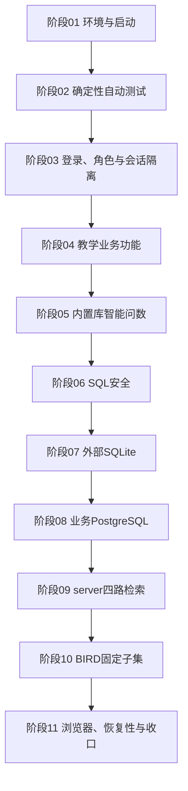

# NL2SQL 教学数据智能问数平台测试向导

更新日期：2026-07-29

适用分支：`zjh-dev`

配套结果表：`D:\NL2SQL2\outputs\final-test-guide-20260729\NL2SQL2项目测试用例与结果表.xlsx`

## 1. 文档目的

本文用于引导一名不了解源码细节的测试者，从环境准备、项目启动开始，按固定顺序完成功能、权限、智能问数、SQL 安全、外部数据源、server 四路检索、BIRD 固定子集和交付前检查。

本文不是“测试已经通过”的证明。测试者必须在配套表格中填写本次实际结果、证据位置和问题编号。过去的 `298/298`、BIRD `15/15` 可执行、严格执行准确率 `10/15` 等数字只能作为历史对照，不能代替本次重新执行。

## 2. 对测试要求的事实修正

### 2.1 可以手工完成与不能只靠手工完成的部分

- 登录、页面、业务流程、角色权限、智能问数和外部数据源接入适合人工浏览器验收。
- SQL 安全不能只看页面提示，必须结合确定性自动测试和生成 SQL 证据。
- BIRD 的“执行准确率（Execution Accuracy，EX）”需要自动执行预测 SQL 和标准 SQL并比较结果集，不能仅凭测试者阅读回答判断。
- 大模型输出具有非确定性。复现标准应以数据源、角色范围、生成 SQL、结果集、错误码和检索路线为准，不能要求回答文字逐字相同。
- server 模式依赖 Docker、Milvus、Elasticsearch 和 PostgreSQL/pgvector。组件不可用时的降级属于单独场景，不能把“页面仍返回结果”直接写成“四路检索通过”。

### 2.2 角色数量说明

README 公开演示账号包含管理员、教务、学院、教师、学生五类。当前 V3 助手场景还包含辅导员，因此完整角色测试应覆盖六类业务角色：

1. 平台管理员 `admin`；
2. 教务 `academic_office`；
3. 学院负责人 `college_manager`；
4. 任课教师 `teacher`；
5. 学生 `student`；
6. 辅导员 `counselor`。

若当前演示库没有可登录的辅导员账号，应把辅导员用例记为“阻塞：缺少测试账号或角色绑定”，不能记为通过，也不能临时修改产品数据掩盖。

### 2.3 BIRD 结论边界

本项目仓库当前没有 BIRD 下载器和一键完整评测脚本。`scripts/eval.py` 是通用执行准确率评测器，`scripts/verify_server_backend.py` 是四路检索验证器。课程内部曾使用 `european_football_2` 的固定 15 题子集，因此本文复用同一题号和固定清单哈希。

- 固定题号：`1035, 1044, 1048, 1078, 1145, 1025, 1030, 1040, 1057, 1091, 1098, 1107, 1028, 1042, 1139`。
- 固定清单 SHA-256：`f6c2b1073af9b2f00cf1efb04b260c84088ae10eb94c2cfab32855ae1b6ea51b`。
- 课程内部最低门槛：15 题中至少 12 题生成 SQL 并成功执行，至少 9 题 EX 通过。
- 历史原始对照门槛：至少 14 题可执行、至少 11 题 EX；它不是本轮强制门槛。
- 官方完整 BIRD Dev 有更大的公开评测范围；15 题结果只能称为“项目固定子集结果”，不得写成官方完整 BIRD 分数。

BIRD 数据、下载和官方指标应以 [BIRD 官方网站](https://bird-bench.github.io/) 为准。

## 3. 测试停止条件和优先级

### 3.1 优先级

- `P0`：项目启动、登录、权限、主要教学流程、只读 SQL 安全、内置库问数、外部双库查询主闭环。任何失败都阻断演示验收。
- `P1`：追问、治理、server 四路、BIRD 固定子集、异常恢复。失败必须记录，是否阻断由课程演示范围决定。
- `P2`：移动端、性能观察、非关键显示细节。允许带已知问题交付，但不得写成已通过。

配套用例标题以 `[P0]`、`[P1]`、`[P2]` 标识优先级。

### 3.2 整体通过条件

1. 所有 P0 用例已经执行且通过；
2. 自动测试没有失败；若收集数不是历史 298，必须解释增减原因；
3. 六角色中的适用角色没有跨身份、跨学院、跨课程或跨学生数据泄露；
4. 危险 SQL、越权字段、多语句和写操作被拒绝；
5. 内置教学库、外部 SQLite 和外部 PostgreSQL 至少各完成一次 Schema 浏览和一次真实问数；
6. server 验收明确记录四路是否真实命中，不能只记录 Docker 容器启动；
7. BIRD 固定 15 题达到课程最低门槛，或如实记录未达到；
8. 每个失败/阻塞项都有证据和问题编号；
9. `.env`、数据库密码、真实业务数据、日志中的令牌没有进入表格或提交文件。

## 4. 测试环境与资料准备

### 4.1 建议环境

| 项目 | 要求 |
|---|---|
| 操作系统 | Windows 11；PowerShell |
| Python | 以 `requirements.txt` 可安装版本为准，记录 `python --version` |
| 浏览器 | Edge 或 Chrome，记录版本 |
| Docker | Docker Desktop + Compose，仅 server/PostgreSQL 阶段需要 |
| 模型 | DashScope/Qwen，有可用额度 |
| 本地模式 | `RETRIEVAL_BACKEND=local` |
| server 模式 | Elasticsearch、Milvus、PostgreSQL/pgvector 全部健康 |

### 4.2 必备资料

- 当前 `zjh-dev` 项目副本；
- 不含真实密钥的 `.env.example`；
- 本机私有 `.env`，至少配置 `DASHSCOPE_API_KEY` 和 `AUTH_SECRET`；
- 六类角色账号或无法提供时的阻塞说明；
- 可丢弃的外部 SQLite 测试库；
- PostgreSQL 只读测试账号和独立测试数据库；
- BIRD 官方数据、固定 15 题清单及对应标准 SQL；
- 空白证据目录和配套 Excel 结果表。

### 4.3 数据安全

业务写操作会改变 `data/teaching.db`。推荐在单独测试副本中执行，不要直接在准备提交的工作区执行。至少先停止服务并备份：

```powershell
$runId = Get-Date -Format "yyyyMMdd-HHmmss"
$evidence = "D:\NL2SQL2-test-evidence\$runId"
New-Item -ItemType Directory -Path $evidence -Force
Copy-Item data\teaching.db "$evidence\teaching.before.db"
git status --short > "$evidence\git-status-before.txt"
```

不得把 `.env`、令牌、数据库密码、真实学生隐私字段复制到证据目录。截图中出现令牌或密码时必须遮盖。

## 5. 总体执行顺序



不要在前一阶段存在 P0 阻断时继续执行后续昂贵模型或 BIRD 测试。先登记问题，停止本轮；未经批准不要边测边改代码。

## 6. 阶段 01：环境、依赖与启动

对应表格：`ENV-001`～`ENV-008`。

### 测试目的

确认测试结论对应明确版本，Python 依赖和私有配置可用，应用能导入、启动并返回健康状态。涉及：

- `requirements.txt`；
- `.env.example`、`app/core/config.py`；
- `app/main.py`、`app/api/routes.py`；
- `data/teaching.db` 和启动迁移。

### 执行步骤

1. 在测试副本根目录记录版本：

   ```powershell
   git branch --show-current
   git rev-parse HEAD
   git status --short
   python --version
   docker version
   docker compose version
   ```

2. 创建虚拟环境并安装依赖：

   ```powershell
   python -m venv .venv
   .\.venv\Scripts\Activate.ps1
   python -m pip install -r requirements.txt
   ```

3. 从 `.env.example` 创建本机 `.env`，手工填入密钥；不要把值粘贴到结果表。
4. 验证导入：

   ```powershell
   python -c "import app.main; print('app import ok')"
   ```

5. 启动应用：

   ```powershell
   uvicorn app.main:app --host 127.0.0.1 --port 8000
   ```

6. 浏览器打开：

   - `http://127.0.0.1:8000/`
   - `http://127.0.0.1:8000/docs`
   - `http://127.0.0.1:8000/api/health`

7. 健康接口必须明确反映应用与教学库状态；不能只以“网页能打开”判定后端健康。

### 证据

- 分支、提交号和工作区状态；
- Python、Docker 版本；
- 安装命令退出码；
- 启动日志首屏；
- `/api/health` 响应；
- 首页和 Swagger 截图。

## 7. 阶段 02：确定性自动测试

对应表格：`AUTO-001`～`AUTO-005`。

### 测试目的

人工点击无法覆盖所有权限条件和 SQL 安全分支，因此先运行确定性基线。涉及 `tests/` 下 37 个测试模块、`scripts/eval_v3_scenarios.py` 和 `scripts/run_stage_f_regression.py`。

### 执行步骤

```powershell
python -m compileall -q app tests scripts
python -m pytest --collect-only -q
python -m pytest -q
python scripts/eval_v3_scenarios.py --validate-only
python scripts/run_stage_f_regression.py
```

长命令必须记录开始时间、PID、CPU变化和进度。若 60 秒无新增输出且 CPU/进度均不变，按第14条原则检查是否卡死；确认卡死后终止并保存日志，不得无限等待或重复启动多个测试进程。

### 判定

- `compileall` 退出码为 0；
- Pytest 无失败、错误或意外跳过；
- 收集数量记录为本次实际值，不预填 298；
- V3 场景结构校验无错误；
- Stage F 回归完成且无失败。

## 8. 阶段 03：登录、角色权限和会话隔离

对应表格：`AUTH-001`～`AUTH-009`。

### 测试目的

确认 `business_domains.py`、`authorization.py`、`assistant_context.py`、`assistant_sessions.py` 与前端角色导航共同落实身份、页面能力、行级范围和会话隔离。

### 执行方法

1. 分别以管理员、教务、学院、教师、学生登录；如有辅导员账号也必须登录。
2. 每次登录记录首页角色标签、可见导航和至少一个禁止页面。
3. 学生只应看到本人；教师只应看到本人授课班；学院只能看到本学院；教务可见校级教学管理范围；管理员可进行平台管理。
4. 若账号有多个角色绑定，执行角色切换并确认页面能力、数据范围和助手会话立即变化。
5. 在角色 A 创建助手会话，然后切换到角色 B，确认角色 B 看不到角色 A 会话；切回后会话仍按原身份存在。
6. 使用错误密码验证登录拒绝，不能泄露账号是否存在或内部异常。

### 注意

“菜单隐藏”不是权限通过的充分证据。至少对一个禁止能力直接访问对应 API 或通过浏览器开发者工具重放请求，确认后端返回 401/403 或安全拒绝。

## 9. 阶段 04：教学业务功能

对应表格：`BUS-001`～`BUS-016`。

### 测试目的

验证项目不仅能问数，还能完成课程实践要求中的主要教学业务流程。

### 管理员与组织

- 查看组织岗位、账号和角色绑定；
- 冻结/恢复测试账号并验证旧会话失效；
- 查看数据接入、Schema 画像和治理入口；
- 生命周期操作仅在测试副本执行，操作前后保留审计证据。

涉及 `organization_access.py`、`identity_registration.py`、`lifecycle.py`、`staff_lifecycle.py`、`student_lifecycle.py`。

### 教务与学院

- 教学驾驶舱按学年、学期、学院和状态筛选；
- 教师提交成绩，学院审核，教务发布；
- 学院不能处理其他学院的数据；
- 教学异常筛选和处理必须保留服务端范围。

涉及 `stage_e.py`、`course_analytics.py`、教学 API 和前端驾驶舱。

### 教师

- 查看本人课程空间；
- 创建作业并检查学生可见；
- 发布课程公告或资料；
- 创建考勤场次、批量点名、修正并保留痕迹；
- 回复课程答疑；
- 对未交名单生成提醒草稿，确认草稿不等于自动发送，仍须显式发布。

涉及 `assignment_workflow.py`、`course_space.py`、`stage_d.py`、`action_drafts.py`。

### 学生

- 查看本人课程和通知；
- 查看、提交、修改作业版本；
- 查看已发布成绩，不能看到未发布成绩；
- 发起公开或私密答疑；
- 不能访问其他学生作业、成绩和通知。

### 辅导员

- 查看本人负责班级学习支持个案；
- 不能查看非带班学生；
- 助手生成的跟进动作必须先形成草稿，不应自动写业务事实。

涉及 `support_workflow.py`。

### 数据回退

所有会写数据库的用例使用唯一标题，例如 `TEST-<RUN_ID>-BUS-008`。结束后只在测试副本中清理；提交工作区不得保留测试公告、作业、通知和个人数据。

## 10. 阶段 05：内置教学库智能问数

对应表格：`NLQ-001`～`NLQ-014`。

### 测试目的

验证 `assistant_orchestrator.py → service.py → schema/retrieval → chain.py → validator.py → executor.py → answer_evidence.py` 的完整主链。

### 必测问法

1. 简单列表：“我本学期有哪些课程？”
2. 聚合：“各学院当前教学班数量是多少？”
3. 多表关联：“列出我未完成的作业、课程和截止时间。”
4. 空结果：选择数据库中确认不存在的条件。
5. 模糊问法：缺少必要对象或时间时应澄清，而不是编造 SQL。
6. 追问：
   - 首问：“我有哪些作业未完成？”
   - 追问：“按课程分组。”
   - 再追问：“只看已经截止的。”
7. 日期边界：精确某日与“截至某日”分别验证，不漏掉当天带时间的数据。
8. 重复稳定性：关键问题连续执行 3 次，允许 SQL 表达不同，但范围和结果集不能随机越权。
9. 不支持问题：与教学数据无关的问题应返回明确不支持状态。
10. 证据与导出：检查数据源、角色范围、生成 SQL、执行摘要、可信度和 CSV 导出。

### 判定原则

- 先用数据库基准 SQL 得到期望结果，再提问；不能用页面自己回答自己。
- “late” 必须结合提交记录和项目口径判断，不能仅凭英文标签推断为未提交。
- 问题成功不等于 SQL 正确。必须展开生成 SQL，并核对表、连接、范围条件、日期和结果行。
- 追问必须在同一会话执行；刷新或新会话后的无上下文行为另测。
- 模型超时、额度不足和安全拒绝分开记录，不能统一写成“查询失败”。

## 11. 阶段 06：SQL 安全与数据权限

对应表格：`SEC-001`～`SEC-011`。

### 测试目的

验证 `validator.py`、`executor.py`、`business_domains.py` 和服务端上下文的双重限制。

### 必测类型

- `INSERT`、`UPDATE`、`DELETE`、`DROP` 等写操作；
- 分号拼接的多语句；
- 注释、大小写和空白变体绕过；
- 未授权表；
- 身份证、电话、密码哈希、内部 ID 等受限字段；
- 学生、教师、学院的行级越权；
- 合法括号内业务 `OR`；
- 可把身份范围绕开的顶层 `OR`；
- 子查询或集合查询绕过；
- 超长输入、超时和最大行数。

### 执行方法

1. 先运行相关自动测试：

   ```powershell
   python -m pytest -q tests/test_security.py tests/test_role_permissions.py tests/test_ask_regression.py
   ```

2. 再通过页面或 `/api/ask` 执行人工负例。
3. 记录 HTTP 状态、结构化错误码、生成 SQL、失败阶段和数据库是否发生变化。
4. 对写操作负例，测试前后比较目标表行数或文件哈希。

### 判定

安全用例的“通过”通常意味着请求被拒绝且数据未改变；不能把“SQL 成功执行”写成通过。

## 12. 阶段 07：外部 SQLite 接入

对应表格：`SQLITE-001`～`SQLITE-007`。

### 测试资料

准备一个可公开、可丢弃的 SQLite 文件，至少包含：

- 两张有外键关系的表；
- 一张带日期和金额的业务表；
- 10 条以上已知记录；
- 一份基准 SQL 与期望结果；
- 不含真实个人隐私。

记录数据库文件 SHA-256。不要使用 `data/teaching.db` 冒充外部库。

### 执行步骤

1. 管理员进入“数据维护”。
2. 上传 `.db/.sqlite/.sqlite3` 或注册本地 SQLite。
3. 查看数据源列表、连接状态和方言。
4. 扫描 Schema，核对真实表名、字段和外键。
5. 分页浏览已知数据并与 SQLite 客户端基准比较。
6. 从外部数据源入口进入统一助手，明确选择该 source 后提问。
7. 展开 SQL，确认没有错误引用 `teaching` 表，也没有切回内置源。
8. 以非管理员登录，确认外部源不可见且直接请求被拒绝。
9. 对未标记 `writable: true` 的源尝试写操作，必须拒绝。

### 证据

源名称、文件哈希、Schema 表数、基准 SQL、问数 SQL/结果、非管理员拒绝和写操作拒绝。

## 13. 阶段 08：业务 PostgreSQL 接入

对应表格：`PG-001`～`PG-007`。

### 测试资料

- 独立测试数据库；
- 只读账号；
- 密码只保存在环境变量或本机 `.env`，注册表不出现明文；
- 两张以上有关联的业务表和固定基准结果；
- 可选：Docker 中单独启动的测试 PostgreSQL，不能复用检索索引库冒充业务库而不说明。

### 执行步骤

1. 用原生客户端验证只读账号可以 `SELECT`、不能写。
2. 管理员在数据维护页面测试连接并注册 PostgreSQL。
3. 检查 `data_sources.yaml`：URL 应使用密码引用或脱敏形式，不得出现真实密码。
4. 扫描 Schema 和外键。
5. 浏览已知表并对照基准。
6. 选择该 source 问数，核对 PostgreSQL 方言、真实 source 和结果。
7. 非管理员不可见、不可问外部 source。
8. 写操作必须被数据库只读权限和应用只读链双重拒绝。

### 注意

如果连接失败，必须区分网络、驱动、账号、密码引用、SSL、Schema 权限和应用错误。不得把所有失败都归为“PostgreSQL 不支持”。

## 14. 阶段 09：server 四路检索

对应表格：`SERVER-001`～`SERVER-007`。

### 测试目的

确认大库模式真实使用：

- Milvus：向量召回；
- Elasticsearch：关键词/BM25；
- PostgreSQL/pgvector：业务词表向量；
- NetworkX 关系图：连接关系补全。

### 执行步骤

1. 检查 Compose：

   ```powershell
   docker compose config
   docker compose up -d --build
   docker compose ps
   ```

2. 等待所有健康检查完成；分别访问/连接 ES、Milvus 和 PostgreSQL。
3. 在测试进程的私有环境配置：

   ```env
   RETRIEVAL_BACKEND=server
   ES_URL=http://localhost:9200
   MILVUS_URI=http://localhost:19530
   PG_DSN=postgresql://<本地测试账号>@localhost:5433/nl2sql_retrieval
   ```

4. 执行：

   ```powershell
   python scripts/verify_server_backend.py teaching "统计各学院当前开设的教学班数量"
   ```

5. `retrievers_used` 必须同时出现 `vector`、`keyword`、`glossary`、`graph`，且图节点/关系来自真实 Schema。
6. 对外部大库重复验证，不能只用内置教学库。
7. 停掉一个组件，执行降级用例；记录缺失路线和最终行为。
8. 恢复组件，确认索引可重建或命中缓存。

### 判定

- 容器运行只证明基础设施启动；
- `verify_server_backend.py` 返回上下文只证明检索入口工作；
- 最终还需完成至少一次“server 检索 → 生成 SQL → 安全校验 → 外部库执行”的端到端查询。

## 15. 阶段 10：BIRD 固定 15 题

对应表格：`BIRD-001`～`BIRD-007`，逐题结果填写工作簿“BIRD结果”。

### 数据准备

1. 从 BIRD 官方来源取得与固定清单兼容的 Dev/Mini-Dev 数据。
2. 确认 `european_football_2` SQLite 数据库可只读打开。
3. 建立固定清单，包含题号、问题、难度、数据库、标准 SQL、证据字段。
4. 对固定清单计算 SHA-256，必须等于：

   `f6c2b1073af9b2f00cf1efb04b260c84088ae10eb94c2cfab32855ae1b6ea51b`

若官方数据版本不同导致哈希不同，应记录版本差异并停止与历史数字直接比较。

### 运行方法

仓库内 `scripts/eval.py` 支持自定义用例 YAML，但每个 case 必须声明正确 `source` 和 `expected_sql`：

```powershell
python scripts/eval.py --cases <固定15题YAML> --source bird_european_football --verbose --json <证据目录>\bird-local.json
```

server 模式还需在同一固定清单上运行，并记录每题 `retrievers_used`。若使用仓库外验收脚本，必须把脚本版本、提交号和清单哈希一并保存，不能只保存最终数字。

### EX 判定

1. 预测 SQL 必须无错误执行；
2. 标准 SQL 必须在同一数据库执行；
3. 若标准 SQL 含 `ORDER BY`，按有序结果比较；
4. 否则按无序多重集比较；
5. 统一处理 `NULL` 和数值表示差异；
6. 只要结果集不一致，EX 就是失败，即使回答看起来合理；
7. 记录失败类型：不可执行、表/列错误、连接错误、过滤错误、聚合错误、日期错误、多列投影或结果不一致。

### 汇总

- `可执行率 = 可执行题数 / 15`；
- `EX = 结果匹配题数 / 15`；
- `四路命中率 = 同时使用四路的题数 / 15`；
- 结果写入“BIRD结果”与“测试概览”，不得只写百分比而丢失逐题证据。

## 16. 阶段 11：浏览器、恢复性和收口

对应表格：`NF-001`～`NF-005`。

### 必测内容

- Edge/Chrome 完整刷新后静态资源版本一致；
- 两个浏览器会话使用不同角色，不串会话和 source；
- 模型超时后页面退出加载状态，可再次提问；
- CSV 导出防止 Excel 公式注入；
- 桌面与窄屏下主要页面仍可操作；
- 日志、截图、结果表中没有真实密钥、令牌和数据库密码。

### 收口步骤

1. 停止 Uvicorn 和测试进程；
2. 记录进程已退出；
3. 需要时执行 `docker compose down`，不要擅自删除 volumes；
4. 再次记录 `git status --short`；
5. 对比测试前后的 `teaching.db` 和配置；
6. 将失败项登记到 `PROJECT_ISSUES.md`，未经批准不修改产品；
7. 填写 Excel“执行记录”和“测试概览”；
8. 只提交经过审核的源码、测试、文档和允许的数据文件。

## 17. 证据命名规范

建议目录：

```text
<RUN_ID>/
├─ environment/
├─ automatic/
├─ browser/
├─ nl2sql/
├─ security/
├─ external-sqlite/
├─ external-postgresql/
├─ server/
├─ bird/
└─ closeout/
```

单个证据文件使用：

```text
<用例ID>__<简短说明>__<时间>.png|json|log|txt
```

例如：

```text
NLQ-006__unfinished-assignment-follow-up__20260729-143000.json
SEC-009__top-level-or-rejected__20260729-150500.png
BIRD-1035__server-result__20260729-164000.json
```

## 18. 问题记录规则

失败时至少记录：

- 用例 ID、执行时间和环境；
- 复现步骤；
- 预期与实际；
- 角色、source 和页面；
- 生成 SQL、错误码、失败阶段；
- 数据库基准证据；
- 是否稳定复现、复现次数；
- 影响范围；
- 临时绕过方式；
- 证据路径。

仅发生一次的模型波动应写“实际发生一次，尚待重复验证”，不能直接写成稳定缺陷。连续三次同条件失败后，才可以写成稳定复现。

## 19. 配套结果表填写方法

### “测试用例”

保留模板的八列结构。`实际结果`初始为“未执行”，执行后填写简短事实，例如：

```text
通过：HTTP 200；返回4行；source=teaching；证据=NLQ-003__result.json
```

或：

```text
失败：生成SQL遗漏student_id范围；3/3复现；问题=ZJH-XXX
```

### “执行记录”

每次重测新增一行，不覆盖旧记录。相同用例可有多个 Run ID，用于区分修正前后。

### “测试概览”

统计以“执行记录”的状态为准。没有执行记录的用例仍属于未执行。

### “BIRD结果”

固定 15 行，不新增或删除题号后再与历史门槛比较。若更换子集，应新建运行批次和新哈希。

## 20. 本测试向导对应的主要源码

| 测试主题 | 主要模块 |
|---|---|
| 启动与健康 | `app/main.py`、`app/api/routes.py`、`app/core/config.py` |
| 认证与角色 | `app/core/business_domains.py`、`authorization.py`、`organization_access.py` |
| 助手与会话 | `assistant_orchestrator.py`、`assistant_context.py`、`assistant_sessions.py` |
| NL2SQL | `app/service.py`、`chain.py`、`schema.py`、`validator.py`、`executor.py` |
| 检索 | `app/core/retrieval/` |
| 作业与课程 | `assignment_workflow.py`、`course_space.py` |
| 考勤与答疑 | `stage_d.py` |
| 教学运行 | `stage_e.py`、`course_analytics.py` |
| 辅导员支持 | `support_workflow.py` |
| 外部数据源 | `app/api/data_access.py`、`app/core/data_access.py`、`data_sources.py` |
| 治理 | `schema_profile.py`、`governance.py`、`feedback.py`、`examples.py` |
| 前端 | `app/static/` |
| 自动回归 | `tests/`、`scripts/eval_v3_scenarios.py`、`scripts/run_stage_f_regression.py` |

更完整的逐文件关系见 `docs/project_file_catalog.md`。
