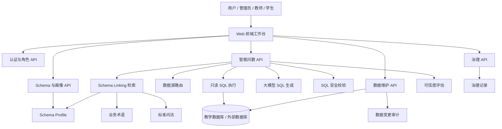
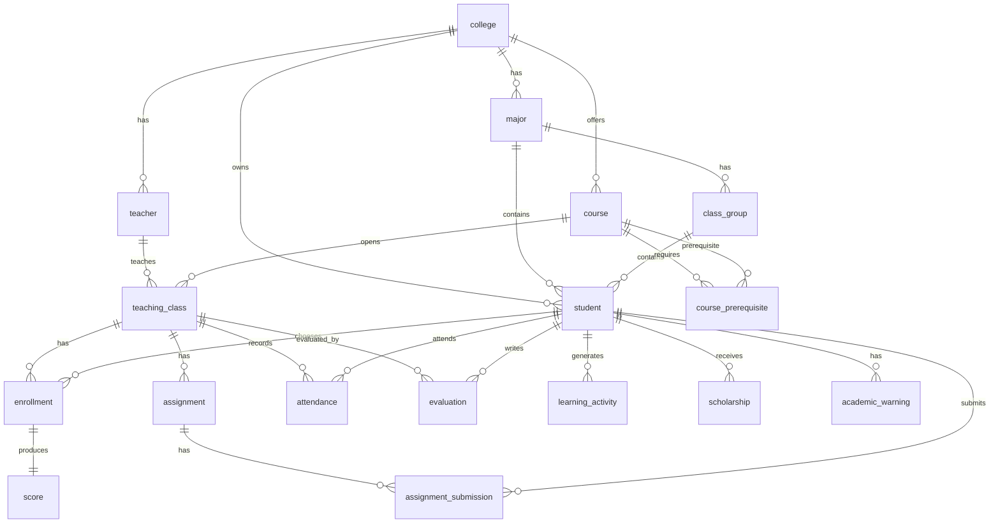
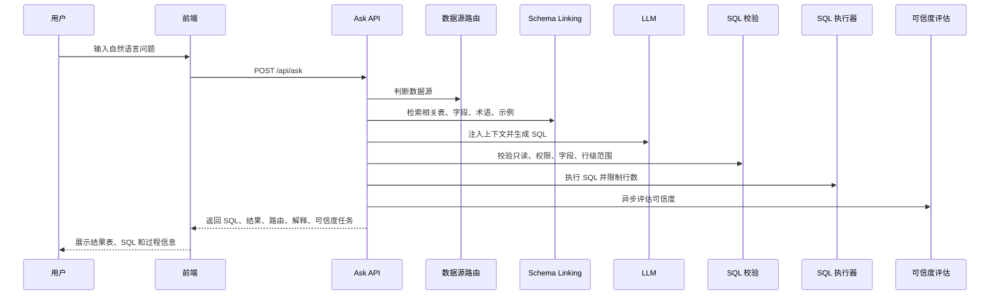

# 基于 Web 的教学数据管理与智能问数平台系统设计说明

## 1. 项目概述

本项目设计并实现了一个面向教学业务场景的 Web 数据管理与智能问数平台。系统以教学数据为核心，围绕学生、教师、课程、成绩、考勤、作业、教学评价、学业预警等业务对象，提供数据总览、自然语言问数、Schema 语义画像、知识治理、角色权限控制、数据接入与维护等功能。

项目的核心目标不是简单地把自然语言转换为 SQL，而是构建一套具备数据资产管理能力的教学数据平台：业务用户可以通过自然语言提问获取统计结果，数据管理员可以维护数据源和 Schema 语义，治理人员可以将错误反馈、低可信查询和标准问法沉淀为可复用知识，系统通过权限控制和 SQL 安全校验保证问数过程可控。

## 2. 需求分析

### 2.1 功能需求

系统主要面向以下角色：

| 角色 | 主要诉求 |
|---|---|
| 校级管理员 | 查看全校教学数据总览，管理数据源、Schema 画像、治理队列和角色权限 |
| 教务处老师 | 查询教学质量、成绩分布、课程运行、学业预警等教学管理指标 |
| 学院负责人 | 查看本学院范围内的学生、课程、成绩和预警数据 |
| 任课教师 | 查询本人授课班级、学生成绩、考勤和作业提交情况 |
| 学生用户 | 查询本人相关的课程、成绩、考勤等有限范围数据 |

核心功能包括：

1. 用户登录与角色权限控制。
2. 教学数据总览，包括学生人数、课程数、选课记录、成绩、挂科率、出勤率、学业预警等指标。
3. 智能问数，支持中文自然语言提问，自动路由数据源、召回 Schema、生成 SQL、执行查询并返回结果。
4. SQL 安全控制，限制只读查询、表白名单、字段权限、行级范围和结果行数。
5. Schema 画像工作台，维护表业务名、字段中文名、枚举值、默认过滤、指标口径、表关系和版本。
6. 治理队列，沉淀用户反馈、低可信查询、发布审核等治理事项。
7. 数据接入与维护，支持 SQLite/CSV 接入、表数据维护和变更审计。
8. 召回调试，展示 Schema linking、路由、SQL 生成和执行链路。

### 2.2 非功能需求

| 类型 | 要求 |
|---|---|
| 可用性 | Web 页面直接操作，默认内置演示账号和教学数据，便于课堂演示 |
| 安全性 | 登录鉴权、角色权限、SQL 只读校验、字段屏蔽、行级范围限制 |
| 可扩展性 | 数据源通过 `data_sources.yaml` 配置，支持 SQLite 和 PostgreSQL 扩展 |
| 可维护性 | Schema 画像、业务术语、标准问法和治理记录均可沉淀为文件或配置 |
| 可解释性 | 问数结果展示 SQL、路由、召回、可信度和治理建议 |
| 可演示性 | 内置教学数据、角色账号、仪表盘、智能问数和治理闭环 |

## 3. 总体架构设计

系统采用前后端一体的 Web 架构，后端使用 FastAPI 提供 REST API，前端使用原生 HTML/CSS/JavaScript 实现交互界面，数据层默认使用 SQLite，并可扩展 PostgreSQL 等外部数据源。



### 3.1 前端层

前端位于 `app/static/`，主要文件包括：

| 文件 | 作用 |
|---|---|
| `index.html` | 页面结构和主要视图容器 |
| `style.css` | 全局样式、仪表盘、Schema 工作台、数据维护等页面样式 |
| `app.js` | 登录、导航、智能问数、知识库、Schema 画像、仪表盘等核心交互 |
| `data-access-view.js` | 数据维护页面交互 |
| `governance-view.js` | 治理队列页面交互 |
| `api.js` | REST API 封装 |

前端采用单页应用式结构，通过侧边栏切换不同 `work-view`，主要页面包括：

1. 教学数据总览
2. 智能问数
3. 数据维护
4. 问数知识库
5. Schema 画像
6. 质量治理
7. 治理设置
8. 权限矩阵
9. 账号管理
10. 召回调试

### 3.2 后端层

后端入口为 `app/main.py`，核心 API 位于 `app/api/`：

| 模块 | 作用 |
|---|---|
| `routes.py` | 登录、数据源、Schema、问数、Profile、反馈、示例、调试等核心接口 |
| `governance.py` | 治理队列、审核、采纳、驳回、治理设置 |
| `data_access.py` | 数据源接入、CSV 导入、表数据维护、审计日志 |

核心业务逻辑位于 `app/core/`：

| 模块 | 作用 |
|---|---|
| `service.py` | 智能问数主流程编排 |
| `chain.py` | 大模型调用、SQL 生成和修复 |
| `source_router.py` | 多数据源路由 |
| `schema.py` | 数据库 Schema 读取、字段元数据抽取 |
| `schema_profile.py` | Schema 画像、版本、质量报告 |
| `validator.py` | SQL 只读校验、表白名单、字段权限、行级范围 |
| `executor.py` | SQL 执行、超时和行数限制 |
| `judge.py` | 可信度评估 |
| `business_domains.py` | 角色、业务域、权限和登录令牌 |
| `retrieval/` | Schema linking 多路召回 |
| `teaching_dashboard.py` | 教学仪表盘统计 |
| `data_access.py` | 数据源注册、CSV 转 SQLite、行级维护和审计 |

### 3.3 数据层

默认教学数据库为 `data/teaching.db`，数据源配置位于 `data_sources.yaml`。系统还使用若干文件目录保存知识和运行时数据：

| 路径 | 内容 |
|---|---|
| `data/teaching.db` | 默认教学演示数据库 |
| `data/glossaries/teaching.md` | 教学业务术语、指标口径、表关系说明 |
| `data/schema_profiles/teaching.yaml` | 结构化 Schema 画像 |
| `data/examples/teaching.json` | 标准问法和 few-shot 示例 |
| `data/governance/` | 治理队列和治理设置 |
| `data/feedback/` | 用户反馈 |
| `data/audit/` | 数据维护审计日志 |
| `data/managed/` | CSV 或上传 DB 转换后的托管数据库 |
| `data/retrieval_index/` | 本地检索索引缓存 |

## 4. 数据库设计

默认教学数据库围绕教学管理业务建模，包含组织、学生、教师、课程、教学班、选课、成绩、考勤、作业、评价、奖学金、学业预警等表。

### 4.1 核心实体

| 表 | 说明 |
|---|---|
| `college` | 学院 |
| `major` | 专业 |
| `class_group` | 行政班 |
| `student` | 学生 |
| `teacher` | 教师 |
| `course` | 课程 |
| `course_prerequisite` | 先修课程关系 |
| `teaching_class` | 开课班 |
| `enrollment` | 选课记录 |
| `score` | 成绩 |
| `evaluation` | 教学评价 |
| `assignment` | 作业 |
| `assignment_submission` | 作业提交 |
| `attendance` | 考勤 |
| `learning_activity` | 学习行为 |
| `scholarship` | 奖学金 |
| `academic_warning` | 学业预警 |

### 4.2 主要关系



### 4.3 指标口径

系统在业务术语和 Schema Profile 中沉淀常用指标：

| 指标 | 口径 |
|---|---|
| 在读学生数 | `COUNT(student.id)`，默认 `student.status = 'active'` |
| 平均分 | `AVG(score.final_score)` |
| 及格率 | `AVG(CASE WHEN score.final_score >= 60 THEN 1.0 ELSE 0.0 END)` |
| 挂科率 | `AVG(CASE WHEN score.final_score < 60 THEN 1.0 ELSE 0.0 END)` |
| 出勤率 | `AVG(CASE WHEN attendance.status = 'present' THEN 1.0 ELSE 0.0 END)` |
| 缺勤率 | `AVG(CASE WHEN attendance.status = 'absent' THEN 1.0 ELSE 0.0 END)` |
| 未解除预警数 | `SUM(CASE WHEN academic_warning.resolved = 0 THEN 1 ELSE 0 END)` |

## 5. 功能模块设计

### 5.1 用户认证与角色权限模块

系统内置演示账号：`admin`、`jwc`、`college`、`teacher`、`student`。登录成功后后端生成 HMAC 签名的演示令牌，前端在请求头 `X-Demo-Token` 中携带该令牌。

权限控制包含三层：

1. 功能权限：控制用户能否访问问数、Schema、治理、数据维护等模块。
2. 表级权限：不同角色只能访问对应业务域的数据表。
3. 行级范围：学院负责人限制学院范围，教师限制本人授课范围，学生限制本人数据范围。

### 5.2 教学数据总览模块

该模块面向教学管理场景，提供多维度数据统计：

1. 学生规模和学院分布。
2. 本学期开课和选课规模。
3. 平均成绩、及格率、挂科率。
4. 课程成绩分布、低分课程、挂科率排行。
5. 教师授课工作量。
6. 考勤风险课程。
7. 学业预警分布。

仪表盘会根据当前用户角色自动裁剪可见数据。

### 5.3 智能问数模块

智能问数模块是系统核心。用户输入中文问题后，系统自动完成数据源选择、Schema 召回、SQL 生成、安全校验、执行和结果解释。



### 5.4 Schema 画像模块

Schema 画像用于将数据库结构转换为业务可理解的语义资产。系统支持维护：

1. 表业务名、表说明、表粒度、默认时间字段、默认过滤条件。
2. 字段中文名、业务描述、枚举值、单位、默认聚合、语义类型。
3. 敏感字段、废弃字段、禁用字段。
4. 表关系和 JOIN 关系。
5. 指标口径和默认过滤。
6. Profile 发布、版本列表、回滚和删除。

这些配置会被用于前端展示、Schema linking、Prompt 注入和 SQL 安全校验。

### 5.5 治理模块

治理模块负责将用户反馈和系统风险转化为可处理事项。治理队列中的事项主要来源于：

1. 用户反馈错误结果。
2. 用户确认正确结果，沉淀为标准问法。
3. 低可信度查询。
4. Schema Profile 发布审核。

治理人员可以将反馈采纳为标准问法、字段语义、表关系或指标口径，也可以驳回或关闭事项。

### 5.6 数据接入与维护模块

数据维护模块支持：

1. 查看已注册数据源。
2. 测试 SQLAlchemy URL 连接。
3. 注册本地 SQLite 文件。
4. 上传 CSV 并转为 SQLite 数据源。
5. 上传 `.db/.sqlite/.sqlite3` 文件并注册。
6. 扫描表结构。
7. 分页查看表数据。
8. 对显式开启 `writable: true` 的 SQLite 数据源执行新增、修改、删除。
9. 记录数据变更审计日志。

该模块体现了“教学数据管理”的维护能力，区别于只读问数系统。

### 5.7 召回调试模块

召回调试模块用于展示智能问数内部过程，包括：

1. 命中的数据源和路由原因。
2. 检索到的表、字段和业务术语。
3. 使用的召回器。
4. 生成 SQL 的上下文。
5. SQL 执行结果和可信度评估。

该模块提高了系统可解释性，适合答辩时说明 NL2SQL 链路不是黑盒。

## 6. 核心算法与实现

### 6.1 数据源路由

当系统配置多个数据源时，路由模块根据用户问题、历史上下文和数据源描述选择最可能的数据源。如果用户已经手动选择数据源，则优先使用手动选择结果。

### 6.2 Schema Linking

Schema linking 通过多路召回选择与问题相关的表和字段：

1. 关键词召回：使用 BM25 等方法匹配字段名、表名和描述。
2. 向量召回：使用文本向量相似度匹配语义相关字段。
3. 业务术语召回：匹配 glossary 中的指标和口径。
4. 关系图扩展：根据表关系补充 JOIN 所需表。
5. RRF 融合：融合多路召回结果，选出候选表和字段。

### 6.3 SQL 生成与修复

系统将用户问题、Schema 片段、业务术语、角色限制和历史上下文注入 Prompt，由大模型生成 SQL。如果 SQL 执行或校验失败，系统可调用修复链路生成修正 SQL。

### 6.4 SQL 安全校验

SQL 校验器负责保证查询安全：

1. 只允许单条 `SELECT`。
2. 拦截危险关键字和非查询语句。
3. 校验引用表是否在当前角色白名单中。
4. 校验输出字段是否包含敏感或禁止字段。
5. 对 `SELECT *` 做字段权限检查。
6. 校验教师、学生、学院等行级范围谓词。
7. 自动限制最大返回行数。

### 6.5 可信度评估

查询完成后，系统会根据问题、SQL、结果预览和上下文进行可信度评估。评估结果包含完整度、匹配度、风险说明和治理建议。若评估超时，则使用规则兜底。

## 7. 安全设计

系统的安全设计主要体现在认证、授权、SQL 控制和数据维护边界。

| 安全点 | 设计 |
|---|---|
| 登录认证 | HMAC 签名演示令牌，防止伪造普通 token |
| 功能授权 | 按角色控制页面和 API 权限 |
| 表级权限 | 不同角色只能访问业务域允许的数据表 |
| 字段权限 | 禁止输出敏感字段或禁用字段 |
| 行级权限 | 学院、教师、学生角色自动限制数据范围 |
| SQL 只读 | 仅允许单条 SELECT，禁止 DDL/DML |
| 执行限制 | 查询超时、最大行数限制 |
| 数据维护 | 仅维护角色可访问，且只有 writable SQLite 数据源允许写 |
| 审计 | 数据维护操作写入审计日志 |
| CSV 导出 | 前端处理 Excel 公式注入风险 |

## 8. 接口设计

主要 REST API 如下：

| 接口 | 方法 | 说明 |
|---|---|---|
| `/api/health` | GET | 健康检查 |
| `/api/auth/login` | POST | 用户登录 |
| `/api/auth/session` | GET | 获取当前会话 |
| `/api/business-domains` | GET | 获取业务域和权限 |
| `/api/teaching/dashboard` | GET | 教学数据总览 |
| `/api/sources` | GET | 数据源列表 |
| `/api/schema` | GET | 获取 Schema |
| `/api/profile` | GET/PUT | 读取和保存 Schema Profile |
| `/api/profile/publish` | POST | 发布 Profile |
| `/api/profile/rollback` | POST | 回滚 Profile |
| `/api/ask` | POST | 智能问数 |
| `/api/judge` | POST | 可信度评估 |
| `/api/debug/retrieval` | POST | 召回调试 |
| `/api/feedback` | GET/POST/DELETE | 用户反馈 |
| `/api/examples` | GET/POST/DELETE | 标准问法 |
| `/api/governance/*` | 多种 | 治理队列和设置 |
| `/api/data-access/*` | 多种 | 数据接入、维护和审计 |

## 9. 前端页面设计

### 9.1 页面结构

系统采用左侧导航 + 顶部标题 + 主工作区的布局。侧边栏按照业务工作台、数据与知识、治理、系统四类组织页面。

### 9.2 关键页面

| 页面 | 设计目标 |
|---|---|
| 教学数据总览 | 用图表和指标卡展示教学数据管理场景 |
| 智能问数 | 提供自然语言问数、SQL、结果表和可信度解释 |
| 数据维护 | 管理数据源、维护表数据、查看审计 |
| 问数知识库 | 查看数据源知识、健康度、示例和反馈 |
| Schema 画像 | 以配置工作台方式维护表、字段、关系、指标和版本 |
| 质量治理 | 将反馈和低可信查询沉淀为治理事项 |
| 权限矩阵 | 展示不同角色可访问的业务域和表 |
| 召回调试 | 展示智能问数内部检索和生成链路 |

## 10. 测试设计

项目已包含以下测试：

| 测试文件 | 重点 |
|---|---|
| `tests/test_security.py` | 登录令牌、防伪造、管理员权限、Profile 写权限、版本路径安全、行级范围 |
| `tests/test_role_permissions.py` | 角色权限、越权表、敏感字段、`SELECT *` 拦截 |
| `tests/test_governance.py` | 治理设置、反馈入队、发布审核、低可信队列 |

建议大作业提交前执行：

```powershell
python -m compileall -q app tests scripts
python -m pytest
```

建议后续补充：

1. 智能问数主流程冒烟测试。
2. 数据维护写入和审计测试。
3. 前端关键页面截图或 Playwright 测试。
4. 标准演示问题的回归测试。

## 11. 部署与运行

### 11.1 本地运行

```powershell
python -m venv .venv
.\.venv\Scripts\Activate.ps1
pip install -r requirements.txt
uvicorn app.main:app --reload
```

访问：

```text
http://127.0.0.1:8000/
```

### 11.2 环境配置

核心环境变量：

| 变量 | 说明 |
|---|---|
| `DASHSCOPE_API_KEY` | 大模型 API Key |
| `AUTH_SECRET` | 演示登录令牌签名密钥 |
| `QWEN_MODEL` | SQL 生成模型 |
| `JUDGE_MODEL` | 可信度评估模型 |
| `ROUTER_MODEL` | 数据源路由模型 |
| `RETRIEVAL_BACKEND` | 检索后端，支持 `local` 和 `server` |
| `MAX_ROWS` | 最大返回行数 |
| `QUERY_TIMEOUT_SECONDS` | SQL 执行超时 |

## 12. 演示方案

建议答辩时按以下流程演示：

1. 使用 `admin / 123456` 登录系统。
2. 打开教学数据总览，展示学生人数、课程、成绩、挂科率、考勤和预警。
3. 进入智能问数，提问：“各学院平均分和挂科率分别是多少？”
4. 展示生成 SQL、结果表、可信度和召回调试。
5. 切换教师或学生账号，演示不同角色下的权限裁剪。
6. 进入 Schema 画像工作台，展示字段语义、表画像、表关系、指标和版本发布。
7. 提交一次错误反馈，进入治理队列并采纳为标准问法或字段语义。
8. 进入数据维护页，展示数据源、表数据维护和审计日志。

该流程覆盖了“数据管理、智能问数、权限控制、知识治理、数据维护”五个核心设计点。

## 13. 项目特色

1. 不只是自然语言转 SQL，而是构建了教学数据管理和问数治理闭环。
2. 支持角色权限、业务域、表级权限、字段权限和行级范围控制。
3. Schema 画像将数据库结构转化为业务语义资产。
4. 多路 Schema linking 提高复杂问题的表字段召回能力。
5. 可信度评估和治理队列提高系统可解释性和可持续优化能力。
6. 数据维护模块支持接入、维护和审计，体现数据管理平台属性。
7. 默认内置教学场景数据和演示账号，便于课程设计答辩展示。

## 14. 当前不足与改进方向

1. 前端仍以原生 JavaScript 为主，单文件体量较大，后续可拆分为模块化组件。
2. 演示引导还可以进一步增强，例如提供“一键演示脚本”和标准问题库。
3. 智能问数结果解释可以更细化地展示路由、召回、权限和 SQL 校验链路。
4. 测试主要覆盖后端权限和治理，前端自动化测试仍可补充。
5. 默认账号和本地文件存储适合演示，不适合生产环境。
6. 真实部署时需要接入正式认证、数据库账号隔离、日志审计和 HTTPS。
7. 大模型生成 SQL 具有不确定性，复杂问题仍需要通过 Schema 画像、业务术语和标准问法持续治理。

## 15. 总结

本系统围绕教学数据管理场景，完成了从数据接入、权限控制、智能问数、Schema 画像、治理反馈到数据维护审计的完整设计与实现。系统既能展示自然语言问数的智能化能力，也体现了数据平台在权限、安全、语义治理和数据维护方面的工程设计。

作为课程设计或大作业项目，该系统具备较完整的业务场景、清晰的技术架构和可演示的功能闭环。后续可继续围绕演示引导、前端模块化、自动化测试和生产级安全能力进行完善。
